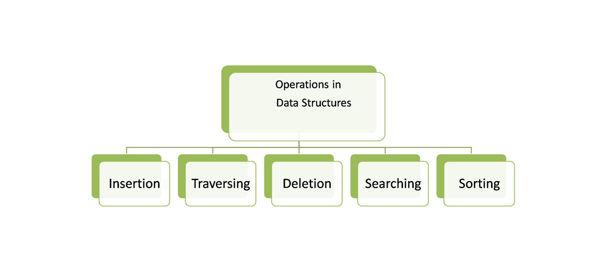
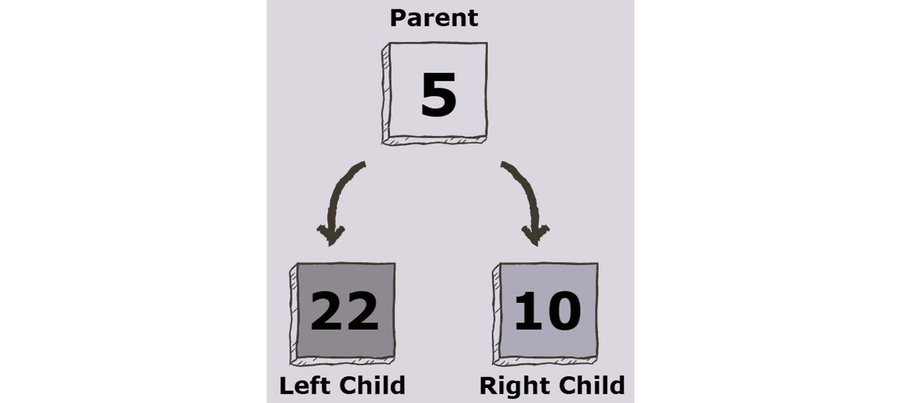

## Data Structures and Algorithms

A comprehensive guide to data structures and algorithms, with detailed explanations and examples.

---

## Table of Contents

### Data Structures

1. [What are Data Structures?](#what-are-data-structures)
2. [Arrays](#arrays)
3. [Hash Tables](#hash-tables)
4. [Linked Lists](#linked-lists)
5. [Stacks and Queues](#stacks-and-queues)
6. [Trees](#trees)
7. [Binary Trees](#binary-trees)
8. [Graphs](#graphs)

### Algorithms

1. [What is an Algorithm?](#what-is-an-algorithm)
2. [Recursion](#recursion)
3. [Stack Overflow](#stack-overflow)
4. [Sorting Algorithms](#sorting-algorithms)
   - [Bubble Sort](#bubble-sort)
   - [Selection Sort](#selection-sort)
   - [Insertion Sort](#insertion-sort)
   - [Divide and Conquer](#divide-and-conquer)
   - [Merge Sort](#merge-sort)
   - [Quick Sort](#quick-sort)
   - [Selecting a Sorting Algorithm](#selecting-a-sorting-algorithm)
5. [Searching Algorithms](#searching-algorithms)
   - [Linear Search](#linear-search)
   - [Binary Search](#binary-search)
   - [BFS](#bfs)
   - [DFS](#dfs)
   - [Selecting a Searching Algorithm](#selecting-a-searching-algorithm)
6. [Dijkstra and Bellman-Ford](#dijkstra-and-bellman-ford)
7. [Negative Edge Weights](#negative-edge-weights)
8. [Relaxation](#relaxation)
9. [Sparse Graphs](#sparse-graphs)
10. [Dynamic Programming](#dynamic-programming)
11. [Caching](#caching)
12. [Memoization](#memoization)

---

## Data Structures

### What are Data Structures?

Data structure is a storage that is used to store and organize data. It is a way of arranging data on a computer so that it can be accessed and updated efficiently. Each data structure is good and is specialized for its own thing.

### Operations On Data Structures

- **Insertion**: Add a new data item in a given collection of items such as us adding the apple item in memory.
- **Deletion**: Delete data such as remove mango from our list.
  Traversal: Traversal simply means accessing each data item exactly once so that it can be processed.
- **Searching**: We want to find out the location of the data item if it exists in a given collection.
- **Sorting**: Having data that is sorted.
- **Access**: How do we access this data that we have on our computer?

[Back to Top](#table-of-contents)

### Arrays

An array is a collection of items of some data type stored at **contiguous** (one after another) memory locations.

Arrays are probably the simplest and most widely used data structures, and also have the smallest overall footprint of any data structure.

Therefore arrays are your best option if all you need to do is store some data and iterate over it.

### Time Complexity

| Operation | Average | Worst |
| --------- | ------- | ----- |
| Access    | O(1)    | O(1)  |
| Search    | O(n)    | O(n)  |
| Insertion | O(n)    | O(n)  |
| Deletion  | O(n)    | O(n)  |

The **space complexity** of an array for the worst case is **O(n)**.

### Types of Arrays

**Static arrays:**

- The size or number of elements in static arrays is fixed. (After an array is created and memory space allocated, the size of the array cannot be changed.)
- The array's content can be modified, but the memory space allocated to it remains constant.

**Dynamic arrays:**

- The size or number of elements in a dynamic array can change. (After an array is created, the size of the array can be changed – the array size can grow or shrink.)
- Dynamic arrays allow elements to be added and removed at the runtime. (The size of the dynamic array can be modified during the operations performed on it.)

### When should an Array be used?

Arrays are excellent for quick lookups. Pushing and popping are really quick.

Naturally, having something organized and close to each other in memory speeds up processing because it is organized.

The only drawback is that whenever it's not at the absolute end of the array, we have to shift to race, which makes inserts and deletions take longer.

Finally, it has a fixed size if static arrays are being used.

As a result, you occasionally need to specify how much memory you will need and the size of the array you desire in advance.

However, we can avoid it if we utilize some of the more modern languages that support dynamic arrays.

**Arrays Good at:**

- Fast lookups
- Fast push/pop
- Ordered

**Arrays Bad at:**

- Slow inserts
- Slow deletes
- Fixed size\* (if using static array)

[Back to Top](#table-of-contents)

### Hash Tables

A hash table is a type of data structure that stores pairs of key-value. The key is sent to a hash function that performs arithmetic operations on it.

The result (commonly called the hash value or hashing) is the index of the key-value pair in the hash table

### Key-Value

**Key:** unique integer that is used for indexing the values.
**Value:** data that are associated with keys.

### What Does Hash Function Mean?

A hash function takes a group of characters (called a key) and maps it to a value of a certain length (called a hash value or hash). The hash value is representative of the original string of characters, but is normally smaller than the original.

Hashing is done for indexing and locating items in databases because it is easier to find the shorter hash value than the longer string. Hashing is also used in encryption. This term is also known as a hashing algorithm or message digest function.

### Collisions

A collision occurs when two keys get mapped to the same index. There are several ways of handling collisions.

### Some ways to handle collisions

**Linear probing**

If a pair is hashed to a slot which is already occupied, it searches linearly for the next free slot in the table.

**Chaining**

The hash table will be an array of linked lists. All keys mapping to the same index will be stored as linked list nodes at that index.

**Resizing the hash table**

The size of the hash table can be increased in order to spread the hash entries further apart. A threshold value signifies the percentage of the hash-table that needs to be occupied before resizing.

A hash table with a threshold of 0.6 would resize when 60% of the space is occupied. As a convention, the size of the hash-table is doubled. This can be memory intensive.

### When should a Hash Table be used?

Hash tables have incredibly quick lookups, but remember that we need a reliable collision solution; normally, we don't need to worry about this because our language in the computer beneath the hood takes care of it for us.

It allows us to respond quickly, and depending on the type of hash table, such as maps in JavaScript, we can have flexible keys instead of an array with 0 1 2 3 only numbered indexes.

The disadvantage of hash tables is that they are unordered. It's difficult to go through everything in an orderly fashion.

Furthermore, it has slow key iteration. That is, if I want to retrieve all the keys from a hash table, I have to navigate the entire memory space.

### Time Complexity

| Operation | Average | Worst |
| --------- | ------- | ----- |
| Search    | O(1)    | O(n)  |
| Insertion | O(1)    | O(n)  |
| Deletion  | O(1)    | O(n)  |
| Space     | O(n)    | O(n)  |

**Hash Tables Good at:**

- Fast lookups^
- Fast inserts
- Flexible Key
  ^Good collision resolution needed

**Hash Tables Bad at:**

- Unordered
- Slow key iteration

### Hash Tables vs. Arrays

We've noticed a few differences between hash tables and arrays.

- When it comes to looking for items, hash tables are usually faster.
- In arrays, you must loop over all items before finding what you are looking for, while with a hash table, you go directly to the item's location.
- Inserting an item in Hash tables is also faster because you simply hash the key and insert it.
- In arrays shifting the items is important first before inserting another one.

**Important Note:** When choosing data structures for specific tasks, you must be extremely cautious, especially if they have the potential to harm the performance of your product.

Having an O(n) lookup complexity for functionality that must be real-time and relies on a large amount of data could make your product worthless.

Even if you feel that the correct decisions have been taken, it is always vital to verify that this is accurate and that your users have a positive experience with your product.

[Back to Top](#table-of-contents)

### Linked Lists

A linked list is a common data structure made of one or more nodes. Each node contains a value and a pointer to the previous/next node forming the chain-like structure. These nodes are stored randomly in the system's memory, which improves its space complexity compared to the array.

### What is a pointer?

In computer science, a **pointer** is an object in many programming languages that stores a memory address. This can be that of another value located in computer memory, or in some cases, that of memory-mapped computer hardware.

A pointer references a location in memory, and obtaining the value stored at that location is known as dereferencing the pointer.

As an analogy, a page number in a book's index could be considered a pointer to the corresponding page; dereferencing such a pointer would be done by flipping to the page with the given page number and reading the text found on that page.

Person and newPerson in the example above both point to the same location in memory.

### The BIG O of Linked-lists:

| prepend | 0(1) |
| ------- | ---- |
| append  | O(1) |
| lookup  | O(n) |
| insert  | O(n) |
| delete  | O(n) |

### Types of Linked Lists

- **Singly linked list**

The singly linked list (SLL) is a linear data structure comprising of nodes chained together in a single direction. Each node contains a data member holding useful information, and a pointer to the next node.

The problem with this structure is that it only allows us to traverse forward, i.e., we cannot iterate back to a previous node if required.

This is where the doubly linked list (DLL) shines. DLLs are an extension of basic linked lists with only one difference.

- **Doubly linked list**

A doubly linked list contains a pointer to the next node as well as the previous node. This ensures that the list can be traversed in both directions.

From this definition, we can see that a DLL node has **three** fundamental members:

- the data
- a pointer to the next node
- a pointer to the previous node

A DLL costs more in terms of memory due to the inclusion of a p (previous) pointer. However, the reward for this is that iteration becomes much more efficient.

**Linked Lists Good at:**

- Fast insertion
- Fast deletion
- Ordered
- Flexible size

**Linked Lists Bad at:**

- Slow Lookup
- More Memory

[Back to Top](#table-of-contents)

### Stacks and Queues

Stacks and Queues are both what we call linear data structures. Linear data structures allow us to traverse (that is go through) data elements sequentially (one by one) in which only one data element can be directly reached.

Unlike an array in stacks and queues there's no random access operation. We mainly use stacks and queues to run commands like push, peak, pop. All of which deal exclusively with the element at the beginning or the end of the data structure.

### Stack: LIFO (Last In First Out) structure.

Stack is a linear data structure in which the element inserted last is the element to be deleted first. It is also called Last In First Out (LIFO). In a stack, the last inserted element is at the top.

**Operations**
| Operation | Details | Time Complexity |
|-----------|---------------------------------------------------|-----------------|
| Push | Inserts an element into the stack at the end. | O(1) |
| Peek | Returns the last inserted element. | O(1) |
| Pop | Deletes and returns the last inserted element. | O(1) |

### Queue: FIFO (First In First Out) structure.

A queue is another common data structure that places elements in a sequence, similar to a stack. A queue uses the FIFO method (First In First Out), by which the first element that is enqueued will be the first one to be dequeued.

**Operations**
| Operation | Details | Time Complexity |
|-----------|---------------------------------------------------|-----------------|
| Enqueue | Inserts an element to the end of the queue. | O(1) |
| Dequeue | Removes an element from the start of the queue. | O(1) |
| IsEmpty | Returns `true` if the queue is empty. | O(1) |
| Peek | Returns the first element of the queue. | O(1) |

These higher-level data structures, which are built on top of lower-level ones like linked lists and arrays, are beneficial for limiting the operations you can perform on the lower-level ones.

In computer science, that is actually advantageous. The fact that you have this restricted control over a data structure is advantageous.

Users of this data structure solely carry out their efficient write operations. It's harder for someone to work if you give them all the tools in the world than if you simply give them two or three so they know exactly what they need to do.

**Stacks and Queues Good at:**

- Fast Operations
- Fast Peek
- Ordered

**Stacks and Queues Bad at:**

- Slow Lookup

[Back to Top](#table-of-contents)

### Trees

A Tree is a non-linear data structure and a hierarchy consisting of a collection of nodes such that each node of the tree stores a value and a list of references to other nodes (the “children”).

This data structure is a specialized method to organize and store data in the computer to be used more effectively.

It consists of a central node, structural nodes, and sub-nodes, which are connected via edges. We can also say that tree data structure has roots, branches, and leaves connected with one another.

Why is Tree considered a non-linear data structure?
The data in a tree are not stored in a sequential manner i.e, they are not stored linearly. Instead, they are arranged on multiple levels or we can say it is a hierarchical structure.

For this reason, the tree is considered to be a non-linear data structure.

[Back to Top](#table-of-contents)

### Binary Trees

A binary tree is a tree data structure composed of nodes, each of which has at most, two children, referred to as left and right nodes. The tree starts off with a single node known as the root.

**Each node in the tree contains the following:**

- Data
- Pointer to the left child
- Pointer to the right child
- In case of a leaf node, the pointers to the left and right child point to **null**

### Types Of Binary Trees

**Full Binary Tree**

A full Binary tree is a special type of binary tree in which every parent node/internal node has either two or no children.

**Perfect Binary Tree**

A perfect binary tree is a type of binary tree in which every internal node has exactly two child nodes and all the leaf nodes are at the same level.

**Complete Binary Tree**

A complete binary tree is a binary tree in which all the levels are completely filled except possibly the lowest one, which is filled from the left.

A complete binary tree is just like a full binary tree, but with two major differences:

1. All the leaf elements must lean towards the left.
2. The last leaf element might not have a right sibling i.e. a complete binary tree doesn't have to be a full binary tree.

[Back to Top](#table-of-contents)

### Graphs

A collection of nodes (vertices) connected by edges.

[Back to Top](#table-of-contents)

---

## Algorithms

### What is an Algorithm?

A step-by-step procedure for solving a problem or performing a computation.

[Back to Top](#table-of-contents)

### Recursion

A method where a function calls itself to solve smaller instances of the same problem.

[Back to Top](#table-of-contents)

### Stack Overflow

An error that occurs when the call stack exceeds its limit, often due to infinite recursion.

[Back to Top](#table-of-contents)

### Sorting Algorithms

#### Bubble Sort

A simple sorting algorithm that repeatedly swaps adjacent elements if they are in the wrong order.

[Back to Top](#table-of-contents)

#### Selection Sort

A sorting algorithm that selects the smallest element and swaps it with the first unsorted element.

[Back to Top](#table-of-contents)

#### Insertion Sort

A sorting algorithm that builds the final sorted array one item at a time.

[Back to Top](#table-of-contents)

#### Divide and Conquer

A problem-solving paradigm that breaks a problem into smaller subproblems.

[Back to Top](#table-of-contents)

#### Merge Sort

A divide-and-conquer algorithm that divides the array into halves, sorts them, and merges them.

[Back to Top](#table-of-contents)

#### Quick Sort

A divide-and-conquer algorithm that selects a pivot and partitions the array around it.

[Back to Top](#table-of-contents)

#### Selecting a Sorting Algorithm

Guidelines for choosing the appropriate sorting algorithm based on the problem.

[Back to Top](#table-of-contents)

### Searching Algorithms

#### Linear Search

A simple search algorithm that checks each element sequentially.

[Back to Top](#table-of-contents)

#### Binary Search

A search algorithm that works on sorted arrays by repeatedly dividing the search interval in half.

[Back to Top](#table-of-contents)

#### BFS (Breadth-First Search)

A graph traversal algorithm that explores all nodes at the present depth before moving deeper.

[Back to Top](#table-of-contents)

#### DFS (Depth-First Search)

A graph traversal algorithm that explores as far as possible along each branch before backtracking.

[Back to Top](#table-of-contents)

#### Selecting a Searching Algorithm

Guidelines for choosing the appropriate searching algorithm based on the problem.

[Back to Top](#table-of-contents)

### Dijkstra and Bellman-Ford

Algorithms for finding the shortest path in graphs.

[Back to Top](#table-of-contents)

### Negative Edge Weights

Edge weights in graphs that can be negative, affecting certain algorithms.

[Back to Top](#table-of-contents)

### Relaxation

The process of updating the shortest path estimate for a vertex in graph algorithms.

[Back to Top](#table-of-contents)

### Sparse Graphs

Graphs with relatively few edges compared to the number of vertices.

[Back to Top](#table-of-contents)

### Dynamic Programming

A method for solving complex problems by breaking them into simpler subproblems.

[Back to Top](#table-of-contents)

### Caching

Storing frequently accessed data in a temporary storage area for faster access.

[Back to Top](#table-of-contents)

### Memoization

An optimization technique that stores the results of expensive function calls.

[Back to Top](#table-of-contents)

---

## License

This project is open-source. Feel free to contribute or reuse as needed.
