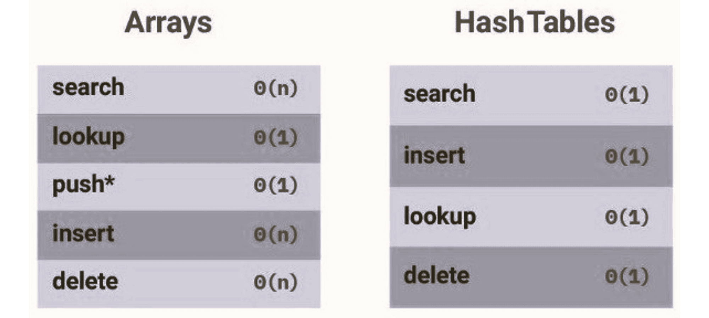
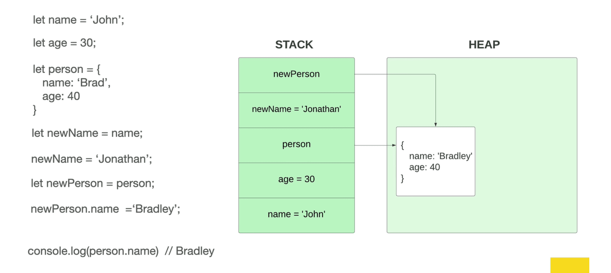
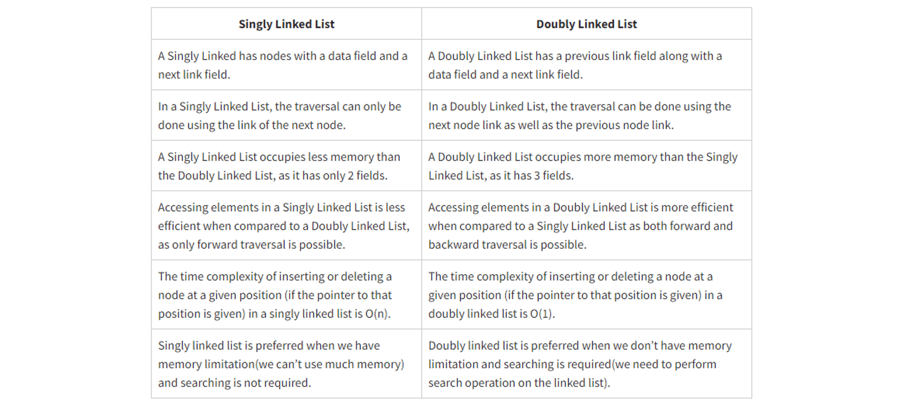
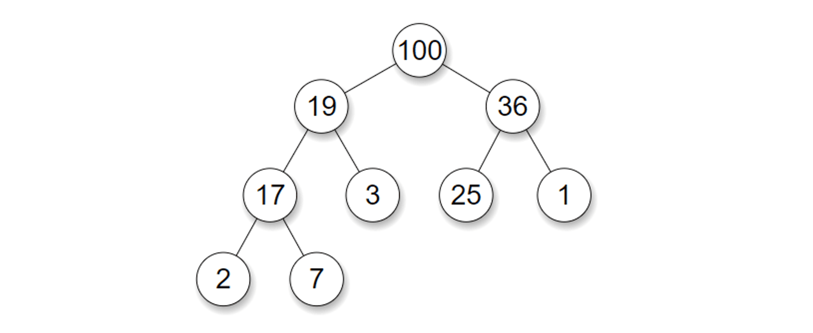
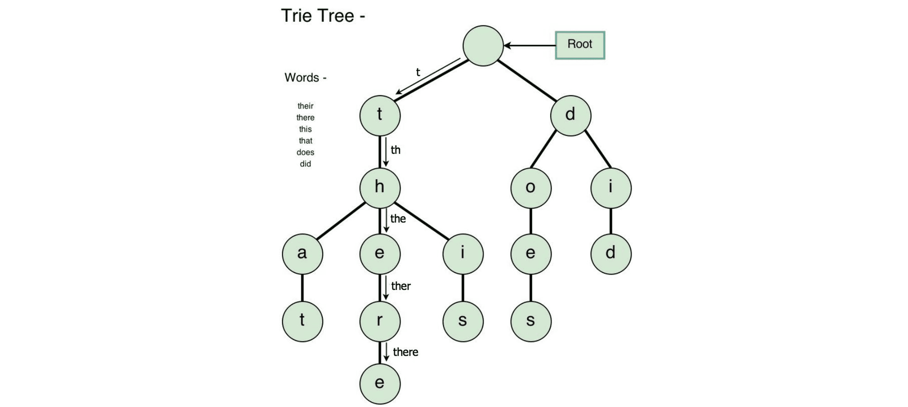
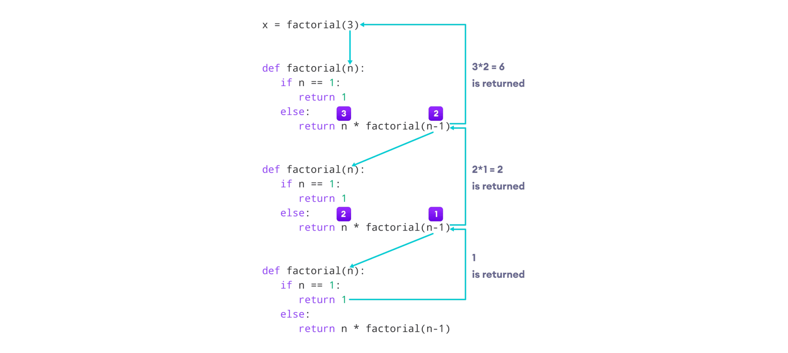
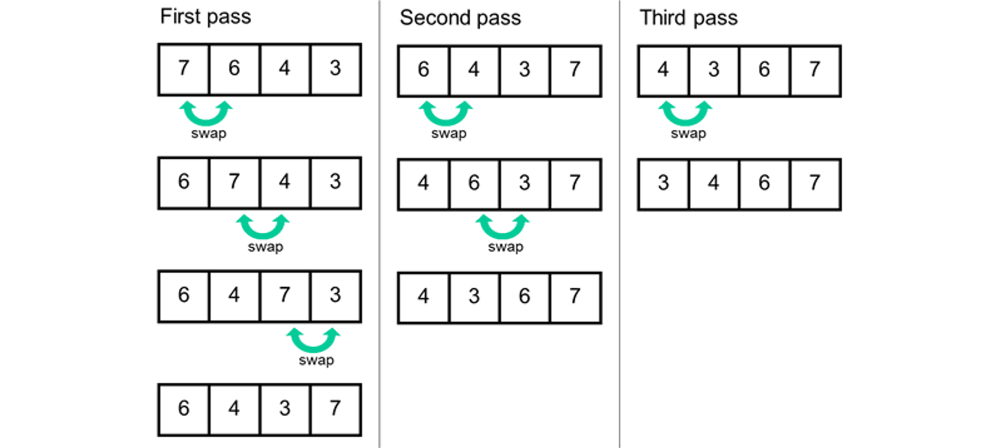
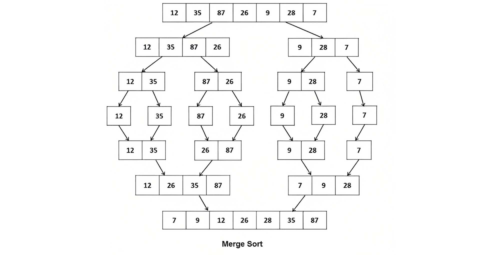

## Data Structures and Algorithms

A comprehensive guide to data structures and algorithms, with detailed explanations and examples.

---

## Table of Contents

### Data Structures

1. [What are Data Structures?](#what-are-data-structures)
2. [Arrays](#arrays)
3. [Hash Tables](#hash-tables)
4. [Linked Lists](#linked-lists)
5. [Stacks and Queues](#stacks-and-queues)
6. [Trees](#trees)
7. [Graphs](#graphs)

### Algorithms

1. [What is an Algorithm?](#what-is-an-algorithm)
2. [Recursion](#recursion)
3. [Sorting Algorithms](#sorting-algorithms)
   - [Bubble Sort](#bubble-sort)
   - [Selection Sort](#selection-sort)
   - [Insertion Sort](#insertion-sort)
   - [Divide and Conquer](#divide-and-conquer)
   - [Merge Sort](#merge-sort)
   - [Quick Sort](#quick-sort)
   - [Selecting a Sorting Algorithm](#selecting-a-sorting-algorithm)
4. [Searching Algorithms](#searching-algorithms)
   - [Linear Search](#linear-search)
   - [Binary Search](#binary-search)
   - [BFS](#bfs)
   - [DFS](#dfs)
   - [Selecting a Searching Algorithm](#selecting-a-searching-algorithm)
5. [Dijkstra and Bellman-Ford](#dijkstra-and-bellman-ford)
6. [Dynamic Programming](#dynamic-programming)

---

## Data Structures

### What are Data Structures?

Data structure is a storage that is used to store and organize data. It is a way of arranging data on a computer so that it can be accessed and updated efficiently. Each data structure is good and is specialized for its own thing.


### Operations On Data Structures

- **Insertion**: Add a new data item in a given collection of items such as us adding the apple item in memory.
- **Deletion**: Delete data such as remove mango from our list.
  Traversal: Traversal simply means accessing each data item exactly once so that it can be processed.
- **Searching**: We want to find out the location of the data item if it exists in a given collection.
- **Sorting**: Having data that is sorted.
- **Access**: How do we access this data that we have on our computer?

## Arrays

An array is a collection of items of some data type stored at **contiguous** (one after another) memory locations.


Arrays are probably the simplest and most widely used data structures, and also have the smallest overall footprint of any data structure.

Therefore arrays are your best option if all you need to do is store some data and iterate over it.

### Time Complexity

| Operation | Average | Worst |
| --------- | ------- | ----- |
| Access    | O(1)    | O(1)  |
| Search    | O(n)    | O(n)  |
| Insertion | O(n)    | O(n)  |
| Deletion  | O(n)    | O(n)  |

The **space complexity** of an array for the worst case is **O(n)**.

### Types of Arrays

**Static arrays:**

- The size or number of elements in static arrays is fixed. (After an array is created and memory space allocated, the size of the array cannot be changed.)
- The array's content can be modified, but the memory space allocated to it remains constant.

**Dynamic arrays:**

- The size or number of elements in a dynamic array can change. (After an array is created, the size of the array can be changed – the array size can grow or shrink.)
- Dynamic arrays allow elements to be added and removed at the runtime. (The size of the dynamic array can be modified during the operations performed on it.)

### When should an Array be used?

Arrays are excellent for quick lookups. Pushing and popping are really quick.

Naturally, having something organized and close to each other in memory speeds up processing because it is organized.

The only drawback is that whenever it's not at the absolute end of the array, we have to shift to race, which makes inserts and deletions take longer.

Finally, it has a fixed size if static arrays are being used.

As a result, you occasionally need to specify how much memory you will need and the size of the array you desire in advance.

However, we can avoid it if we utilize some of the more modern languages that support dynamic arrays.

**Arrays Good at:**

- Fast lookups
- Fast push/pop
- Ordered

**Arrays Bad at:**

- Slow inserts
- Slow deletes
- Fixed size\* (if using static array)

[Back to Top](#table-of-contents)

## Hash Tables

A hash table is a type of data structure that stores pairs of key-value. The key is sent to a hash function that performs arithmetic operations on it.

The result (commonly called the hash value or hashing) is the index of the key-value pair in the hash table


### Key-Value

**Key:** unique integer that is used for indexing the values.
**Value:** data that are associated with keys.

### What Does Hash Function Mean?

A hash function takes a group of characters (called a key) and maps it to a value of a certain length (called a hash value or hash). The hash value is representative of the original string of characters, but is normally smaller than the original.

Hashing is done for indexing and locating items in databases because it is easier to find the shorter hash value than the longer string. Hashing is also used in encryption. This term is also known as a hashing algorithm or message digest function.

### Collisions

A collision occurs when two keys get mapped to the same index. There are several ways of handling collisions.


### Some ways to handle collisions

**Linear probing**

If a pair is hashed to a slot which is already occupied, it searches linearly for the next free slot in the table.

**Chaining**

The hash table will be an array of linked lists. All keys mapping to the same index will be stored as linked list nodes at that index.

**Resizing the hash table**

The size of the hash table can be increased in order to spread the hash entries further apart. A threshold value signifies the percentage of the hash-table that needs to be occupied before resizing.

A hash table with a threshold of 0.6 would resize when 60% of the space is occupied. As a convention, the size of the hash-table is doubled. This can be memory intensive.

### When should a Hash Table be used?

Hash tables have incredibly quick lookups, but remember that we need a reliable collision solution; normally, we don't need to worry about this because our language in the computer beneath the hood takes care of it for us.

It allows us to respond quickly, and depending on the type of hash table, such as maps in JavaScript, we can have flexible keys instead of an array with 0 1 2 3 only numbered indexes.

The disadvantage of hash tables is that they are unordered. It's difficult to go through everything in an orderly fashion.

Furthermore, it has slow key iteration. That is, if I want to retrieve all the keys from a hash table, I have to navigate the entire memory space.

### Time Complexity

| Operation | Average | Worst |
| --------- | ------- | ----- |
| Search    | O(1)    | O(n)  |
| Insertion | O(1)    | O(n)  |
| Deletion  | O(1)    | O(n)  |
| Space     | O(n)    | O(n)  |

**Hash Tables Good at:**

- Fast lookups^
- Fast inserts
- Flexible Key
  ^Good collision resolution needed

**Hash Tables Bad at:**

- Unordered
- Slow key iteration

### Hash Tables vs. Arrays

We've noticed a few differences between hash tables and arrays.

- When it comes to looking for items, hash tables are usually faster.
- In arrays, you must loop over all items before finding what you are looking for, while with a hash table, you go directly to the item's location.
- Inserting an item in Hash tables is also faster because you simply hash the key and insert it.
- In arrays shifting the items is important first before inserting another one.



**Important Note:** When choosing data structures for specific tasks, you must be extremely cautious, especially if they have the potential to harm the performance of your product.

Having an O(n) lookup complexity for functionality that must be real-time and relies on a large amount of data could make your product worthless.

Even if you feel that the correct decisions have been taken, it is always vital to verify that this is accurate and that your users have a positive experience with your product.

[Back to Top](#table-of-contents)

## Linked Lists

A linked list is a common data structure made of one or more nodes. Each node contains a value and a pointer to the previous/next node forming the chain-like structure. These nodes are stored randomly in the system's memory, which improves its space complexity compared to the array.


### What is a pointer?

In computer science, a **pointer** is an object in many programming languages that stores a memory address. This can be that of another value located in computer memory, or in some cases, that of memory-mapped computer hardware.

A pointer references a location in memory, and obtaining the value stored at that location is known as dereferencing the pointer.

As an analogy, a page number in a book's index could be considered a pointer to the corresponding page; dereferencing such a pointer would be done by flipping to the page with the given page number and reading the text found on that page.



Person and newPerson in the example above both point to the same location in memory.

### The BIG O of Linked-lists:

| prepend | 0(1) |
| ------- | ---- |
| append  | O(1) |
| lookup  | O(n) |
| insert  | O(n) |
| delete  | O(n) |

### Types of Linked Lists

- **Singly linked list**

The singly linked list (SLL) is a linear data structure comprising of nodes chained together in a single direction. Each node contains a data member holding useful information, and a pointer to the next node.

The problem with this structure is that it only allows us to traverse forward, i.e., we cannot iterate back to a previous node if required.

This is where the doubly linked list (DLL) shines. DLLs are an extension of basic linked lists with only one difference.


- **Doubly linked list**

A doubly linked list contains a pointer to the next node as well as the previous node. This ensures that the list can be traversed in both directions.

From this definition, we can see that a DLL node has **three** fundamental members:

- the data
- a pointer to the next node
- a pointer to the previous node


A DLL costs more in terms of memory due to the inclusion of a p (previous) pointer. However, the reward for this is that iteration becomes much more efficient.



**Linked Lists Good at:**

- Fast insertion
- Fast deletion
- Ordered
- Flexible size

**Linked Lists Bad at:**

- Slow Lookup
- More Memory

[Back to Top](#table-of-contents)

## Stacks and Queues

Stacks and Queues are both what we call linear data structures. Linear data structures allow us to traverse (that is go through) data elements sequentially (one by one) in which only one data element can be directly reached.

Unlike an array in stacks and queues there's no random access operation. We mainly use stacks and queues to run commands like push, peak, pop. All of which deal exclusively with the element at the beginning or the end of the data structure.

### Stack: LIFO (Last In First Out) structure.

Stack is a linear data structure in which the element inserted last is the element to be deleted first. It is also called Last In First Out (LIFO). In a stack, the last inserted element is at the top.

**Operations**
| Operation | Details | Time Complexity |
|-----------|---------------------------------------------------|-----------------|
| Push | Inserts an element into the stack at the end. | O(1) |
| Peek | Returns the last inserted element. | O(1) |
| Pop | Deletes and returns the last inserted element. | O(1) |


### Queue: FIFO (First In First Out) structure.

A queue is another common data structure that places elements in a sequence, similar to a stack. A queue uses the FIFO method (First In First Out), by which the first element that is enqueued will be the first one to be dequeued.


**Operations**
| Operation | Details | Time Complexity |
|-----------|---------------------------------------------------|-----------------|
| Enqueue | Inserts an element to the end of the queue. | O(1) |
| Dequeue | Removes an element from the start of the queue. | O(1) |
| IsEmpty | Returns `true` if the queue is empty. | O(1) |
| Peek | Returns the first element of the queue. | O(1) |

These higher-level data structures, which are built on top of lower-level ones like linked lists and arrays, are beneficial for limiting the operations you can perform on the lower-level ones.

In computer science, that is actually advantageous. The fact that you have this restricted control over a data structure is advantageous.

Users of this data structure solely carry out their efficient write operations. It's harder for someone to work if you give them all the tools in the world than if you simply give them two or three so they know exactly what they need to do.

**Stacks and Queues Good at:**

- Fast Operations
- Fast Peek
- Ordered

**Stacks and Queues Bad at:**

- Slow Lookup

[Back to Top](#table-of-contents)

## Trees

A Tree is a non-linear data structure and a hierarchy consisting of a collection of nodes such that each node of the tree stores a value and a list of references to other nodes (the “children”).

This data structure is a specialized method to organize and store data in the computer to be used more effectively.

It consists of a central node, structural nodes, and sub-nodes, which are connected via edges. We can also say that tree data structure has roots, branches, and leaves connected with one another.


Why is Tree considered a non-linear data structure?
The data in a tree are not stored in a sequential manner i.e, they are not stored linearly. Instead, they are arranged on multiple levels or we can say it is a hierarchical structure.

For this reason, the tree is considered to be a non-linear data structure.

### Binary Trees

A binary tree is a tree data structure composed of nodes, each of which has at most, two children, referred to as left and right nodes. The tree starts off with a single node known as the root.

**Each node in the tree contains the following:**

- Data
- Pointer to the left child
- Pointer to the right child
- In case of a leaf node, the pointers to the left and right child point to **null**


### Types Of Binary Trees

**Full Binary Tree**

A full Binary tree is a special type of binary tree in which every parent node/internal node has either two or no children.


**Perfect Binary Tree**

A perfect binary tree is a type of binary tree in which every internal node has exactly two child nodes and all the leaf nodes are at the same level.


**Complete Binary Tree**

A complete binary tree is a binary tree in which all the levels are completely filled except possibly the lowest one, which is filled from the left.


A complete binary tree is just like a full binary tree, but with two major differences:

1. All the leaf elements must lean towards the left.
2. The last leaf element might not have a right sibling i.e. a complete binary tree doesn't have to be a full binary tree.

### Binary Search Tree

A Binary Search Tree is a binary tree where each node contains a key and an optional associated value. It allows particularly fast lookup, addition, and removal of items.

The nodes are arranged in a binary search tree according to the following properties:

1. The left subtree of a particular node will always contain nodes with keys less than that node’s key.
2. The right subtree of a particular node will always contain nodes with keys greater than that node’s key.
3. The left and the right subtree of a particular node will also, in turn, be binary search trees.


### Time Complexity

In average cases, the above mentioned properties enable the insert, search and deletion operations in O(log n) time where n is the number of nodes in the tree.

However, the time complexity for these operations is O(n) in the worst case when the tree becomes unbalanced.

### Space Complexity

The space complexity of a binary search tree is O(n) in both the average and the worst cases.

### Balanced vs. Unbalanced BST

A binary tree is called balanced if every leaf node is not more than a certain distance away from the root than any other leaf.

That is, if we take any two leaf nodes (including empty nodes), the distance between each node and the root is approximately the same.

In most cases, "approximately the same" means that the difference between the two distances (root to first leaf and root to second leaf) is not greater than 1, but the exact number can vary from application to application.

This distance constraint ensures that it takes approximately the same amount of time to reach any leaf node in a binary tree from the root. A linked list is a kind of maximally-unbalanced binary tree.


**Binary Search Tree Good at:**

- Better than O(n)
- Ordered
- Flexible Size

**Binary Search Tree Bad at:**

- No O(1) operations

### Balancing a Binary Search Tree

The primary issue with binary search trees is that they can be unbalanced. In the worst case, they are still not more efficient than a linked list, performing operations such as insertions, deletions, and searches in O(n) time.


**AVL Trees**

AVL trees are a modification of binary search trees that resolve this issue by maintaining the balance factor of each node.

**Red-Black Trees**

The red-black tree is another member of the binary search tree family. Like the AVL tree, a red-black tree has self-balancing properties.

### Binary Heap

The binary heap is a binary tree (a tree in which each node has at most two children) which satisfies the following additional properties:

1. The binary tree is complete, i.e. every level except the bottom-most level is completely filled and nodes of the bottom-most level are positioned as left as possible.

2. A Binary Heap is either Min Heap or Max Heap. In a Min Binary Heap, the key at root must be minimum among all keys present in Binary Heap. The same property must be recursively true for all nodes in Binary Tree. Max Binary Heap is similar to MinHeap.



Notice that the binary tree does not enforce any ordering between the sibling nodes.

Also notice that the completeness of the tree ensures that the height of the tree is log(n)⁡, where n is the number of elements in the heap. The nodes in the binary heap are sorted with the priority queue method.

### Priority Queue

A priority queue is a special type of queue in which each element is associated with a priority value. And, elements are served on the basis of their priority. That is, higher priority elements are served first.

However, if elements with the same priority occur, they are served according to their order in the queue.

**Assigning Priority Value**
Generally, the value of the element itself is considered for assigning the priority. For example, The element with the highest value is considered the highest priority element.

However, in other cases, we can assume the element with the lowest value as the highest priority element. We can also set priorities according to our needs.


### Priority Queue vs. Normal Queue

In a queue, the first-in-first-out rule is implemented whereas, in a priority queue, the values are removed on the basis of priority. The element with the highest priority is removed first.

**Binary Heap Good at:**

- Better than O(n)
- Priority
- Flexible Size
- Fast Insert

**Binary Heap Bad at:**

- Slow Lookup

### Trie or Prefix Tree or Radix Tree or Digital Tree

A trie is a special tree that can compactly store strings. Here's a trie that stores ‘this’, ‘there’, ‘that’, ‘does’, ‘did’.



Notice that we only store "there" once, even though it appears in two strings: "that" and "this".

**Trie Strengths:**

- Sometimes Space-Efficient. If you're storing lots of words that start with similar patterns, tries may reduce the overall storage cost by storing shared prefixes once.
- Efficient Prefix Queries. Tries can quickly answer queries about words with shared prefixes, like:
  - How many words start with "choco"?
  - What's the most likely next letter in a word that starts with "strawber"?

**Trie Weaknesses:**

- Usually Space-Inefficient. Tries rarely save space when compared to storing strings in a set.
  - ASCII characters in a string are one byte each. Each link between trie nodes is a pointer to an address—eight bytes on a 64-bit system. So, the overhead of linking nodes together often outweighs the savings from storing fewer characters.
- Not Standard. Most languages don't come with a built-in trie implementation. You'll need to implement one yourself.

**Tries Time Complexity:** O (length of the word)

## Tree Traversal

Tree traversal algorithms systematically visit each node in a tree data structure. The four primary traversal methods are categorized into **depth-first search (DFS)** and **breadth-first search (BFS)**. Below is a breakdown of each method, including steps and Python implementations.

---

## **1. Inorder Traversal (DFS)**

Visits nodes in the order: **Left Subtree → Root → Right Subtree**.  
**Use Case**: Returns nodes of a binary search tree in sorted order[1][3].

### Steps:

1. Recursively traverse the left subtree.
2. Visit the current node.
3. Recursively traverse the right subtree.


```python
def inorder(root):
    if root:
        inorder(root.leftChild)
        print(root.data)
        inorder(root.rightChild)
```

---

## **2. Preorder Traversal (DFS)**

Visits nodes in the order: **Root → Left Subtree → Right Subtree**.  
**Use Case**: Creates tree copies or generates prefix expressions[1][4].

### Steps:

1. Visit the current node.
2. Recursively traverse the left subtree.
3. Recursively traverse the right subtree.


```python
def preorder(root):
    if root:
        print(root.data)
        preorder(root.leftChild)
        preorder(root.rightChild)
```

---

## **3. Postorder Traversal (DFS)**

Visits nodes in the order: **Left Subtree → Right Subtree → Root**.  
**Use Case**: Deletes nodes safely from a tree.

### Steps:

1. Recursively traverse the left subtree.
2. Recursively traverse the right subtree.
3. Visit the current node.


```python
def postorder(root):
    if root:
        postorder(root.leftChild)
        postorder(root.rightChild)
        print(root.data)
```

---

## **4. Level Order Traversal (BFS)**

Visits nodes **level by level**, from left to right.  
**Use Case**: Hierarchical data processing.

### Steps:

1. Use a queue to track nodes.
2. Enqueue the root node.
3. Dequeue a node, print it, and enqueue its children (left first, then right).
4. Repeat until the queue is empty.


```python
from queue import Queue

def levelorder(root):
    if not root:
        return
    q = Queue()
    q.put(root)
    while not q.empty():
        node = q.get()
        print(node.data)
        if node.leftChild:
            q.put(node.leftChild)
        if node.rightChild:
            q.put(node.rightChild)
```

---

### **Key Differences**

| Traversal Type | Order               | Category | Use Case Example             |
| -------------- | ------------------- | -------- | ---------------------------- |
| Inorder        | Left → Root → Right | DFS      | Sorting BST nodes            |
| Preorder       | Root → Left → Right | DFS      | Copying trees                |
| Postorder      | Left → Right → Root | DFS      | Deleting nodes safely        |
| Level Order    | Level-by-level      | BFS      | Processing hierarchical data |

For binary trees, DFS-based traversals (inorder, preorder, postorder) use recursion or stacks, while BFS (level order) relies on queues. Each method serves distinct purposes depending on the required node processing sequence.

[Back to Top](#table-of-contents)

## Graphs

The Graph data structure is a collection of nodes. But unlike with trees, there are no rules about how nodes should be connected. There are no root, parent, or child nodes. Also, nodes are called vertices and they are connected by edges.


Usually, graphs have more edges than vertices. Graphs with more edges than vertices are called dense graphs. If there are fewer edges than vertices, then it’s a sparse graph.

In some graphs, the edges are directional. These are known as directed graphs or digraphs.

Graphs are considered to be connected if there is a path from each vertex to another.

Graphs whose edges are all bidirectional are called undirected graphs, unordered graphs, or just graphs. These types of graphs have no implied direction on edges between the nodes. Edge can be traversed in either direction.

By default, graphs are assumed to be unordered.


In some graphs, edges can have a weight. These are called weighted graphs. So, when I say edges have a weight, what I mean to say is that they have some numbers which typically shows the cost of traversing in a graph.

When we are concerned with the minimum cost of traversing the graph then what we do is we find the path that has the least sum of those weights.


Cyclic graphs are a sort of graph in which the starting vertex also serves as the final vertex. Trees are a special type of graph that includes a path from the starting vertex (the root) to some other vertex. Therefore, trees are Acyclic Graphs.


### Representing Graphs

A graph can be represented using 3 data structures- **adjacency matrix**, **adjacency list** and **Edge List**.

An **adjacency matrix** can be thought of as a table with rows and columns. The row labels and column labels represent the nodes of a graph. An adjacency matrix is a square matrix where the number of rows, columns and nodes are the same. Each cell of the matrix represents an edge or the relationship between two given nodes.


In **adjacency list** representation of a graph, every vertex is represented as a node object. The node may either contain data or a reference to a linked list. This linked list provides a list of all nodes that are adjacent to the current node.


The **Edge List** is another way to represent adjacent vertices. It is much more efficient when trying to figure out the adjacent nodes in a graph. The edge list contains a list of edges in alphanumerical order.


**Graphs Good at:**

- Relationships

**Graphs Bad at:**

- Scaling is hard

[Back to Top](#table-of-contents)

---

## Algorithms

### What is an Algorithm?

An algorithm is a set of instructions or a step-by-step procedure used to solve a problem or perform a specific task.

In computer science, algorithms are typically used to solve computational problems, such as sorting a list of numbers, searching for a particular item in a database, or calculating the shortest path between two points on a graph.

### When do I need to use Algorithms?

They are used whenever you need to perform a specific task that can be broken down into smaller, well-defined steps.

**Some examples of situations where you might use algorithms include:**

- Sorting data
- Searching for information
- Calculating mathematical functions
- Optimizing performance
- Machine learning

Algorithms are typically evaluated based on their efficiency, expressed in terms of time complexity and space complexity.

**Time complexity** refers to the amount of time required for the algorithm to produce the output.

**Space complexity** refers to the amount of memory or storage required by the algorithm.

Efficient algorithms are important because they allow us to solve problems quickly and with fewer resources.

In some cases, the difference between an efficient algorithm and an inefficient algorithm can be the difference between a problem being solvable and unsolvable.

Overall, algorithms are a fundamental concept in computer science and are used extensively in software development, data analysis, and many other fields.

## Recursion

Recursion is a fundamental concept in programming when learning about data structures and algorithms. So, what exactly is recursion?

The process in which a function calls itself directly or indirectly is called recursion and the corresponding function is called a recursive function.

Recursive algorithm is essential to divide and conquer paradigm, whereby the idea is to divide bigger problems into smaller subproblems and the subproblem is some constant fraction of the original problem.

The way recursion works is by solving the smaller subproblems individually and then aggregating the results to return the final solution.


### Stack Overflow

So what happens if you keep calling functions that are nested inside each other? When this happens, it’s called a stack overflow. And that is one of the challenges you need to overcome when it comes to recursion and recursive algorithms.


```python
// When a function calls itself,
// it is called RECURSION
def inception():
    inception()

inception()
// returns Uncaught RangeError:
// Maximum call stack size exceeded
```

### Avoiding Stack Overflow

In order to prevent stack overflow bugs, you must have a base case where the function stops making new recursive calls.

If there is no base case then the function calls will never stop and eventually a stack overflow will occur.

Here is an example of a recursive function with a base case. The base case is when the counter becomes bigger than 3.

```python
counter = 0
def inception():
    global counter
    print(counter)
    if counter > 3:
        return 'done!'
    counter += 1
    return inception()

print(inception())
```

This program does not have a stack overflow error because once the counter is set to 4, the if statement’s condition will be True and the function will return ‘done!’, and then the rest of the calls will also return ‘done!’ in turn.

```python
# Write two functions that find the factorial of any
# number. One should use recursive, the other should just
# use a for loop

# Iterative factorial (using for loop)
def find_factorial_iterative(num):  # O(n)
    res = num
    for i in range(num, 1, -1):  # from num down to 2
        res = res * (i - 1)
    return res

# Recursive factorial
def find_factorial_recursive(num):  # O(n)
    if num == 2:
        return 2
    return num * find_factorial_recursive(num - 1)

print(find_factorial_iterative(3))  # Output: 6
print(find_factorial_recursive(3))  # Output: 6
```



```python

# Given a number N return the index value of the Fibonacci
# sequence, where the sequence is:

# o, 1, 1, 2, 3, 5, 8, 13, 21, 34, 55, 89, 144 ...
# the pattern of the sequence is that each value is the sum of
# the 2 previous values, that means that for N=5 -> 2+3

# Iterative Fibonacci (O(n) time, O(n) space)
def fibonacci_iterative(n):
    fib = [0, 1]
    for i in range(2, n + 1):
        fib.append(fib[i-2] + fib[i-1])
    print(fib[n])
    return fib[n]

# Recursive Fibonacci (O(2^n) time, O(n) space)
def fibonacci_recursive(n):
    if n < 2:
        return n
    return fibonacci_recursive(n-1) + fibonacci_recursive(n-2)

# Testing the functions
print(fibonacci_iterative(5))  # Output: 5 (sequence: 0,1,1,2,3,5)
print(fibonacci_recursive(5))  # Output: 5
```


### Recursion vs. Iteration

| Feature           | Recursion                                    | Iteration                             |
| ----------------- | -------------------------------------------- | ------------------------------------- |
| **Structure**     | Uses selection structure (function calls)    | Uses repetition structure (loops)     |
| **Termination**   | Terminates when base case is met             | Terminates when loop condition fails  |
| **Infinite Case** | Crashes with stack overflow                  | Continuously uses CPU cycles          |
| **Performance**   | Slower (stack overhead)                      | Faster (no stack operations)          |
| **Memory Usage**  | Higher (stack frames accumulate)             | Lower (fixed memory usage)            |
| **Code Size**     | Typically more concise                       | Typically more verbose                |
| **Best For**      | Problems with recursive nature (trees, etc.) | Simple repetitive tasks               |
| **Readability**   | Often more elegant for recursive problems    | More straightforward for simple loops |
| **Debugging**     | Harder (stack traces can be deep)            | Easier (linear execution flow)        |

**Recursion Good at:**

- DRY
- Readability

**Recursion Bad at:**

- Large Stack

**When do I need to use Recursion?**

Every time you are using a tree or converting Something into a tree, consider Recursion.

1. Divided into a number of subproblems that are smaller instances of the same problem.
2. Each instance of the subproblem is identical in nature.
3. The solutions of each subproblem can be combined to solve the problem at hand.

[Back to Top](#table-of-contents)

## Sorting Algorithms

A sorting algorithm is used to arrange elements of an array/list in a specific order.

Sorts are most commonly in numerical or a form of alphabetical (or lexicographical) order, and can be in ascending (A-Z, 0-9) or descending (Z-A, 9-0) order.


**What's all the fuss with sorting?**

1. Sorting algorithms are important because they make it easier and faster to access and process data
2. They are a fundamental part of computer science and good programming practice
3. They can be used to optimize many different operations
4. They have numerous real-world applications in fields such as database management and finance.

Overall, understanding and using sorting algorithms effectively can help improve the performance and efficiency of software systems and data processing operations.

**Why then can't we just use the sort() method that is already built in?**

While the sort() method is a convenient built-in method provided by many programming languages to sort elements, it may not always be the best solution.

- The performance of sort() can vary depending on the size and type of data being sorted
- It may not maintain the order of equal elements
- It may not provide the flexibility to customize sorting criteria
- It may require additional memory to sort large datasets.

Therefore, in some cases, other sorting algorithms or custom sorting functions may be more efficient or appropriate.

**Why are there so many different sorting algorithms?**

There are many different sorting algorithms because each algorithm has its own strengths and weaknesses, and may be more appropriate for certain types of data or situations.

Factors that can influence the choice of sorting algorithm include performance, stability, in-place sorting, data distribution, and implementation complexity.

Therefore, there are many different sorting algorithms to choose from, each with its own unique characteristics, to provide a variety of options for different use cases.

### Bubble Sort

Bubble Sort is a simple sorting algorithm that repeatedly steps through a list of elements, compares adjacent elements and swaps them if they are in the wrong order.

The algorithm gets its name from the way smaller elements "bubble" to the top of the list with each iteration.

**Here are the basic steps of the Bubble Sort algorithm:**

1. Starting at the beginning of the list, compare each pair of adjacent elements.
2. If the elements are in the wrong order (e.g., the second element is smaller than the first), swap them.
3. Continue iterating through the list until no more swaps are needed (i.e., the list is sorted).



The list is now sorted. Bubble Sort has a time complexity of **O(n²)**, making it relatively slow for large datasets.

However, it is easy to understand and implement, and can be useful for small datasets or as a starting point for more optimized sorting algorithms.

```python
numbers = [99, 44, 6, 2, 1, 5, 63, 87, 283, 4, 0]

def bubble_sort(array):
    n = len(array)
    for i in range(n):
        # Last i elements are already in place
        for j in range(n - 1):
            if array[j] > array[j + 1]:
                # Swap elements
                array[j], array[j + 1] = array[j + 1], array[j]

bubble_sort(numbers)
print(numbers)  # [0, 1, 2, 4, 5, 6, 44, 63, 87, 99, 283]
```

### Selection Sort

Selection Sort is another simple sorting algorithm that repeatedly finds the smallest element in an unsorted portion of an array and moves it to the beginning of the sorted portion of the array.

**Here are the basic steps of the Selection Sort algorithm:**

1. Starting with the first element in the array, search for the smallest element in the unsorted portion of the array.
2. Swap the smallest element found in step 1 with the first element in the unsorted portion of the array, effectively moving the smallest element to the beginning of the sorted portion of the array.
3. Repeat steps 1 and 2 for the remaining unsorted elements in the array until the entire array is sorted.


The array is now sorted. Selection Sort has a time complexity of **O(n²)**, making it relatively slow for large datasets.

However, it is easy to understand and implement, and can be useful for small datasets or as a starting point for more optimized sorting algorithms.

```python
numbers = [99, 44, 6, 2, 1, 5, 63, 87, 283, 4, 0]

def selection_sort(array):
    length = len(array)
    for i in range(length):
        # Set current index as minimum
        min_index = i
        temp = array[i]
        for j in range(i+1, length):
            if array[j] < array[min_index]:
                # Update minimum if current is lower
                min_index = j
        # Swap the found minimum element with the first element
        array[i], array[min_index] = array[min_index], array[i]
    return array

selection_sort(numbers)
print(numbers) # [0, 1, 2, 4, 5, 6, 44, 63, 87, 99, 283]
```

### Insertion Sort

Insertion Sort is also another simple sorting algorithm that works by iteratively inserting each element of an array into its correct position within a sorted subarray.

**Here are the basic steps of the Insertion Sort algorithm:**

1. Starting with the second element in the array, iterate through the unsorted portion of the array.
2. For each element, compare it to the elements in the sorted portion of the array and insert it into the correct position.
3. Repeat step 2 for all remaining elements in the unsorted portion of the array until the entire array is sorted.


Insertion Sort has a time complexity of **O(n²)**, making it relatively slow for large datasets.

However, it is efficient for sorting small datasets and is often used as a building block for more complex sorting algorithms.

Additionally, Insertion Sort has a relatively low space complexity, making it useful in situations where memory usage is a concern.

```python
numbers = [99, 44, 6, 2, 1, 5, 63, 87, 283, 4, 0]

def insertion_sort(array):
    length = len(array)
    for i in range(1, length):  # Start from 1 as first element is trivially sorted
        current = array[i]
        # Move elements that are greater than current to one position ahead
        j = i - 1
        while j >= 0 and current < array[j]:
            array[j + 1] = array[j]
            j -= 1
        array[j + 1] = current
    return array

insertion_sort(numbers)
print(numbers) # [0, 1, 2, 4, 5, 6, 44, 63, 87, 99, 283]
```

### Divide and Conquer

The divide-and-conquer paradigm is a problem-solving strategy that involves breaking down a problem into smaller subproblems, solving each subproblem independently, and then combining the solutions into a final solution for the original problem.

**The basic steps of the divide-and-conquer paradigm are:**

1. Divide the problem into smaller subproblems.
2. Conquer each subproblem by solving them recursively or iteratively.
3. Combine the solutions of the subproblems into a solution for the original problem.


This strategy is often used in computer science and mathematics to solve complex problems efficiently.

It is especially useful for problems that can be broken down into smaller, independent subproblems, as it enables parallelization and can reduce the overall time complexity of the algorithm.

The divide-and-conquer paradigm can be a powerful tool for solving complex problems efficiently, but it requires careful consideration of how to divide the problem into subproblems and how to combine the solutions of those subproblems.

### Merge Sort

Merge Sort is a popular sorting algorithm that follows the divide-and-conquer paradigm. It works by dividing the unsorted list into smaller sublists, sorting those sublists recursively, and then merging them back together into the final sorted list.

**Here are the basic steps of the Merge Sort algorithm:**

1. Divide the unsorted list into two sublists of roughly equal size.
2. Sort each of the sublists recursively by applying the same divide-and-conquer strategy.
3. Merge the sorted sublists back together into one sorted list.



Merge Sort has a time complexity of **O(n log n)**, making it more efficient than quadratic sorting algorithms like Bubble Sort, Selection Sort, and Insertion Sort for large datasets.

Additionally, Merge Sort is a stable sorting algorithm, meaning that it maintains the relative order of equal elements.

However, Merge Sort has a relatively high space complexity due to its use of additional memory during the merging process.

```python
numbers = [99, 44, 6, 2, 1, 5, 63, 87, 283, 4, 0]

def merge_sort(array):
    if len(array) == 1:
        return array

    # Split array into right and left
    middle = len(array) // 2
    left = array[:middle]
    right = array[middle:]

    return merge(
        merge_sort(left),
        merge_sort(right)
    )

def merge(left, right):
    result = []
    left_index = 0
    right_index = 0

    while left_index < len(left) and right_index < len(right):
        if left[left_index] < right[right_index]:
            result.append(left[left_index])
            left_index += 1
        else:
            result.append(right[right_index])
            right_index += 1

    # Add remaining elements
    result.extend(left[left_index:])
    result.extend(right[right_index:])

    return result

sorted_numbers = merge_sort(numbers)
print(sorted_numbers) # [0, 1, 2, 4, 5, 6, 44, 63, 87, 99, 283]
```

### Quick Sort

Quick Sort is another popular sorting algorithm that uses the divide-and-conquer paradigm. It works by selecting a pivot element from the array, partitioning the array into two subarrays based on the pivot element, and then recursively sorting each subarray.

**Here are the basic steps of the Quick Sort algorithm:**

1. Choose a pivot element from the array.
2. Partition the array into two subarrays: one containing elements smaller than the pivot element, and one containing elements larger than the pivot element.
3. Recursively apply Quick Sort to each subarray until the entire array is sorted.


Quick Sort has a time complexity of **O(n log n)** on average, making it one of the most efficient sorting algorithms for large datasets.

However, in the worst case (e.g., when the pivot element always selects the maximum or minimum element of the array), Quick Sort can have a time complexity of **O(n²)**.

This worst-case scenario can be avoided by selecting a good pivot element, such as the median or a random element.

Additionally, Quick Sort is an in-place sorting algorithm, meaning that it does not require additional memory beyond the original array.

```python
numbers = [99, 44, 6, 2, 1, 5, 63, 87, 283, 4, 0]

def quick_sort(array, left, right):
    if left < right:
        pivot = right
        partition_index = partition(array, pivot, left, right)

        # Sort left and right partitions
        quick_sort(array, left, partition_index - 1)
        quick_sort(array, partition_index + 1, right)
    return array

def partition(array, pivot, left, right):
    pivot_value = array[pivot]
    partition_index = left

    for i in range(left, right):
        if array[i] < pivot_value:
            swap(array, i, partition_index)
            partition_index += 1

    swap(array, right, partition_index)
    return partition_index

def swap(array, first_index, second_index):
    array[first_index], array[second_index] = array[second_index], array[first_index]


quick_sort(numbers, 0, len(numbers) - 1)
print(numbers) # [0, 1, 2, 4, 5, 6, 44, 63, 87, 99, 283]
```

### Selecting a Sorting Algorithm

When selecting a sorting algorithm, it is important to consider various factors such as the size and distribution of the dataset, as well as the desired time and space complexity.

For large datasets with a relatively uniform distribution of values, **Quick Sort** and **Merge Sort** are generally good choices due to their efficient time complexity of O(n log n).

However, Quick Sort may perform poorly if the pivot element is not chosen carefully, resulting in a worst-case time complexity of O(n²). Merge Sort is a stable sorting algorithm and has a space complexity of O(n).

**Insertion Sort** is a good choice for small datasets or nearly sorted data, with a best-case time complexity of O(n) when the data is already sorted. However, its worst-case time complexity of O(n²) makes it less efficient for large datasets.

**Selection Sort** and **Bubble Sort** have a time complexity of O(n²) and are generally less efficient than other sorting algorithms, especially for large datasets.

In summary, the choice of sorting algorithm should be based on careful consideration of various factors, including the size and distribution of the dataset, as well as the desired time and space complexity.

It is also important to test each sorting algorithm on the specific dataset to be sorted and compare their performance in terms of time and space complexity before making a final decision.

**Comparison Sort Vs Non-Comparison Sort**

**Comparison Sort algorithms** like Quick Sort, Merge Sort, Insertion Sort, Selection Sort, and Bubble Sort compare pairs of elements in the input array using comparison operators to determine their relative order.

**Non-Comparison Sort algorithms** like Counting Sort, Radix Sort, and Bucket Sort do not compare elements, but instead use other information about the elements to determine their correct positions in the sorted output.

Comparison Sort algorithms have a lower bound of O(n log n) time complexity, while Non-Comparison Sort algorithms can have a time complexity of O(n) in some cases.

Comparison Sort algorithms are more widely used and can handle a wider range of input data, but Non-Comparison Sort algorithms can be more efficient when their assumptions about the input data are met.

[Back to Top](#table-of-contents)

## Searching Algorithms

Searching algorithms are important in computer science and programming because they enable efficient data retrieval and processing.

They provide time and resource efficiency, improve user experience, support better decision-making, and optimize the performance of more complex algorithms and data structures.

### Linear Search

Linear search algorithm, also known as sequential search, is a simple searching algorithm that checks each element in a collection one by one until the desired element is found or the entire collection has been searched.

**The steps involved in the linear search algorithm are as follows:**

1. Start at the beginning of the collection.
2. Compare the first element to the desired element.
3. If the elements match, the search is complete and the index of the element is returned.
4. If the elements do not match, move to the next element in the collection and repeat steps 2 and 3.
5. The entire collection has been searched and the element has not been found, return a message indicating that the element is not in the collection.


The time complexity of linear search is O(n), where n is the number of elements in the collection. This means that the time taken to search for an element increases linearly with the size of the collection.

Linear search is a simple and easy-to-understand algorithm, but it is not very efficient for large collections. It is best suited for small collections or for situations where the collection is unsorted or constantly changing.

### Binary Search

Binary search algorithm is a searching algorithm used for finding an element in a sorted collection. The algorithm works by repeatedly dividing the collection in half and checking if the desired element is in the left or right half.

**The steps involved in the binary search algorithm are as follows:**

1. Start with the middle element of the collection.
2. Compare the middle element to the desired element.
3. If the middle element is equal to the desired element, the search is complete and the index of the element is returned.
4. If the middle element is greater than the desired element, the search is conducted on the left half of the collection.
5. If the middle element is less than the desired element, the search is conducted on the right half of the collection.
6. Repeat steps 2-5 until the element is found or the search has been conducted on the entire collection.


The time complexity of binary search is O(log n), where n is the number of elements in the collection. This means that the time taken to search for an element increases logarithmically with the size of the collection.

Binary search is an efficient algorithm for searching in sorted collections, especially for large collections.

However, it requires the collection to be sorted before the search begins. If the collection is unsorted, a sorting algorithm must be used before binary search can be applied.

### Traversal vs. Searching

Traversal involves visiting each element in a data structure and performing some operation on it, while search involves finding a specific element in a data structure based on some criteria.

Traversal is often used to process or analyze the data in a data structure, while searching algorithms are used to efficiently find the desired element.

### BFS (Breadth-First Search)

Breadth-First Search (BFS) is a traversal algorithm that starts at a specified node and explores all the neighboring nodes at the current level before moving on to the next level. It uses a queue data structure to keep track of the nodes to be visited next.

**The steps involved in the BFS algorithm are as follows:**

1. Start at a specified node.
2. Enqueue the node to a queue and mark it as visited.
3. While the queue is not empty:

- Dequeue a node from the front of the queue.
- Visit the node and perform some operation on it.
- Enqueue all the neighboring nodes that have not been visited before and mark them as visited.

4. Repeat step 3 until the queue is empty.


BFS visits all the nodes at each level before moving on to the next level. This ensures that the shortest path between two nodes in an unweighted graph is found. BFS can also be used to find the minimum number of steps required to reach a node from the starting node.

The time complexity of BFS is O(V+E), where V is the number of vertices and E is the number of edges in the graph. The space complexity of BFS is also O(V+E), as it needs to keep track of all the visited nodes and the nodes in the queue.

BFS is a useful algorithm for finding the shortest path in an unweighted graph, and for exploring all the nodes in a graph that are reachable from a starting node.

```python
from collections import deque

def bfs_graph(graph, start):
    visited = set()
    queue = deque([start])
    visited.add(start)
    result = []

    while queue:
        vertex = queue.popleft()
        result.append(vertex)

        for neighbor in graph[vertex]:
            if neighbor not in visited:
                visited.add(neighbor)
                queue.append(neighbor)

    return result


graph = {
    'A': ['B', 'C'],
    'B': ['A', 'D', 'E'],
    'C': ['A', 'F'],
    'D': ['B'],
    'E': ['B', 'F'],
    'F': ['C', 'E']
}

print(bfs_graph(graph, 'A'))  # Output: ['A', 'B', 'C', 'D', 'E', 'F']
```

### DFS (Depth-First Search)

Depth-First Search (DFS) is a traversal algorithm that starts at a specified node and explores as far as possible along each branch before backtracking. It uses a stack data structure to keep track of the nodes to be visited next.

**The steps involved in the DFS algorithm are as follows:**

1. Start at a specified node.
2. Push the node to a stack and mark it as visited.
3. While the stack is not empty:

- Pop a node from the top of the stack.
- Visit the node and perform some operation on it.
- Push all the neighboring nodes that have not been visited before to the stack and mark them as visited.

4. Repeat step 3 until the queue is empty.


DFS explores all the nodes in a branch before backtracking to explore other branches. This makes it useful for exploring all the nodes in a graph and for detecting cycles in a graph. DFS can also be used to find a path between two nodes in a graph.

The time complexity of DFS is O(V+E), where V is the number of vertices and E is the number of edges in the graph. The space complexity of DFS is O(V), as it needs to keep track of all the visited nodes and the nodes in the stack.

DFS is a useful algorithm for exploring all the nodes in a graph and for detecting cycles in a graph. It can also be used to find a path between two nodes in a graph.

```python
def dfs_recursive(graph, node, visited=None, result=None):
    if visited is None:
        visited = set()
    if result is None:
        result = []

    if node not in visited:
        visited.add(node)
        result.append(node)
        for neighbor in graph[node]:
            dfs_recursive(graph, neighbor, visited, result)

    return result


graph = {
    'A': ['B', 'C'],
    'B': ['A', 'D', 'E'],
    'C': ['A', 'F'],
    'D': ['B'],
    'E': ['B', 'F'],
    'F': ['C', 'E']
}

print("Recursive DFS:", dfs_recursive(graph, 'A')) # Output: ['A', 'B', 'D', 'E', 'F', 'C']
```

### BFS vs. DFS

| Feature              | BFS (Breadth-First Search)                                                               | DFS (Depth-First Search)                                                        |
| -------------------- | ---------------------------------------------------------------------------------------- | ------------------------------------------------------------------------------- |
| **Approach**         | Explores level by level                                                                  | Explores branch by branch                                                       |
| **Data Structure**   | Uses a queue                                                                             | Uses a stack (iterative) or recursion                                           |
| **Memory Usage**     | More memory (stores all nodes at current level)                                          | Less memory (only stores current path)                                          |
| **Time Complexity**  | O(V+E)                                                                                   | O(V+E)                                                                          |
| **Space Complexity** | O(V) (worst-case)                                                                        | O(d) (d = maximum depth)                                                        |
| **Use Cases**        | - Shortest path in unweighted graphs<br>- Web crawling<br>- Finding connected components | - Cycle detection<br>- Topological sorting<br>- Solving mazes<br>- Path finding |
| **Best For**         | When target is close to source                                                           | When target is far from source                                                  |
| **Completeness**     | Always finds shortest path                                                               | May not find shortest path                                                      |
| **Optimality**       | Optimal for unweighted graphs                                                            | Not optimal for shortest path problems                                          |

Note that while BFS and DFS have their own strengths and weaknesses, the actual performance of the algorithms may depend on the structure and size of the graph being traversed.

**BFS Good at:**

- Shortest Path
- Closer Nodes

**BFS Bad at:**

- More Memory

**DFS Good at:**

- Less Memory
- Does Path Exist?

**DFS Bad at:**

- Can Get Slow

### Selecting a Searching Algorithm

Linear search is recommended for small, unsorted data or when the order of the elements does not matter. It is a simple algorithm that checks each element of the collection until the target element is found or the end of the collection is reached.

Linear search is easy to implement but can be inefficient for large collections since it has a time complexity of O(n), where n is the number of elements in the collection.

Binary search is recommended for sorted data, as it takes advantage of the sorted order and uses a divide-and-conquer approach to find the target element. It repeatedly divides the search interval in half until the target element is found or the search interval is empty.

Binary search has a time complexity of O(log n), which is much faster than linear search for large collections.

BFS (Breadth-First Search) is recommended for finding the shortest path or distance between two nodes in a graph or tree.

BFS explores all the nodes at the same level before moving to the next level. It uses a queue data structure to keep track of the nodes to be explored and has a time complexity of O(V+E), where V is the number of nodes and E is the number of edges in the graph.

DFS (Depth-First Search) is recommended for exploring all the nodes in a graph or tree. DFS explores as far as possible along each branch before backtracking. It uses a stack data structure to keep track of the nodes to be explored and has a time complexity of O(V+E), where V is the number of nodes and E is the number of edges in the graph.

In summary, the choice of the search algorithm depends on the properties of the data, the order of the elements, and the specific problem being solved. The time complexity of each algorithm should also be considered, as it can greatly impact the performance of the search.

[Back to Top](#table-of-contents)

### Dijkstra and Bellman-Ford

Another two algorithms for finding the shortest path between two nodes in a graph are the Bellman-Ford and Dijkstra algorithms.

Bellman-Ford can handle graphs with negative edge weights, while Dijkstra cannot.

Bellman-Ford algorithm performs relaxation of all edges in the graph repeatedly until it finds the shortest path with a time complexity of O(VE), while Dijkstra algorithm maintains a priority queue of the next nodes to visit, with a time complexity of O((V+E)logV).

The choice between the two algorithms depends on the properties of the graph being searched.

If the graph has negative edge weights, Bellman-Ford should be used.

If the graph has only non-negative edge weights, Dijkstra may be faster for sparse graphs.

Dijkstra's and Bellman-Ford algorithms are fundamental for solving shortest-path problems in weighted graphs. Here's a structured comparison with implementations:

---

## **Dijkstra's Algorithm**

Finds shortest paths from a source node in graphs **with non-negative weights**. Uses a greedy approach with a priority queue.

### Steps:

1. **Initialize distances**: Set source distance to 0, others to infinity.
2. **Priority queue**: Track nodes by current shortest distance.
3. **Node selection**: Extract the node with minimum distance.
4. **Edge relaxation**: Update adjacent nodes' distances if a shorter path is found.
5. **Repeat** until all nodes are processed.


```python
import heapq

def dijkstra(graph, source, destination):
    # Initialize distances with infinity and set source distance to 0
    distances = {node: float('infinity') for node in graph}
    distances[source] = 0

    # Priority queue: (distance, node)
    priority_queue = [(0, source)]

    # Previous nodes to reconstruct the path
    previous_nodes = {node: None for node in graph}

    while priority_queue:
        current_distance, current_node = heapq.heappop(priority_queue)

        # If we've already found a better path, skip
        if current_distance > distances[current_node]:
            continue

        # Check all neighbors
        for neighbor, weight in graph[current_node].items():
            distance = current_distance + weight

            # If we found a shorter path to the neighbor
            if distance < distances[neighbor]:
                distances[neighbor] = distance
                previous_nodes[neighbor] = current_node
                heapq.heappush(priority_queue, (distance, neighbor))

    # Reconstruct the shortest path
    path = []
    current = destination
    while current is not None:
        path.append(current)
        current = previous_nodes[current]
    path.reverse()

    return distances[destination], path


graph = {
    'a': {'b': 5, 'c': 2},
    'b': {'a': 5, 'c': 7, 'd': 8},
    'c': {'a': 2, 'b': 7, 'd': 4, 'e': 8},
    'd': {'b': 8, 'c': 4, 'e': 6, 'f': 4},
    'e': {'c': 8, 'd': 6, 'f': 3},
    'f': {'e': 3, 'd': 4}
}

source = 'a'
destination = 'f'

distance, path = dijkstra(graph, source, destination)
print(f"Shortest distance from {source} to {destination}: {distance}")
print(f"Path: {' -> '.join(path)}")

# Output
# Shortest distance from a to f: 11
# Path: a -> c -> d -> f
```

**Key Features**:

- Time Complexity: **O((V + E) log V)** where V is vertices and E is edges
- Fails with negative edge weights

---

## **Bellman-Ford Algorithm**

Finds shortest paths in graphs **with negative weights** and detects negative cycles.

### Steps:

1. **Initialize distances**: Source = 0, others = infinity.
2. **Relax edges**: Update distances for all edges **V-1** times.
3. **Negative cycle check**: Validate if further distance reductions occur after **V-1** iterations.


```python
def bellman_ford(V, edges, src):
    # Initialize distances from src to all other vertices as infinity
    dist = [float('inf')] * V
    dist[src] = 0

    # Relax all edges |V| - 1 times
    for _ in range(V - 1):
        updated = False
        for u, v, w in edges:
            if dist[u] != float('inf') and dist[u] + w < dist[v]:
                dist[v] = dist[u] + w
                updated = True
        if not updated:  # Early exit if no updates in a full pass
            break

    # Check for negative-weight cycles
    for u, v, w in edges:
        if dist[u] != float('inf') and dist[u] + w < dist[v]:
            print("Graph contains negative weight cycle")
            return None

    return dist


V = 5
edges = [
    [1, 3, 2],
    [4, 3, -1],
    [2, 4, 1],
    [1, 2, 1],
    [0, 1, 5]
]
src = 0

result = bellman_ford(V, edges, src)

if result:
    print("Vertex Distance from Source")
    for i in range(V):
        print(f"{i}\t\t{result[i]}")


# Output
Vertex Distance from Source
0               0
1               5
2               6
3               7
4               7
```

**Key Features**:

- Time Complexity: **O(VE)** where V = number of vertices, E = number of edges
- Handles negative weights and detects cycles

---

### **Comparison Table**

| Feature         | Dijkstra           | Bellman-Ford                |
| --------------- | ------------------ | --------------------------- |
| Edge Weights    | Non-negative only  | Allows negative             |
| Cycle Handling  | No negative cycles | Detects negative cycles     |
| Time Complexity | **O((V+E) log V)** | **O(VE)**                   |
| Use Cases       | Routing, maps      | Financial networks, physics |

---

### **Implementation Notes**

- **Dijkstra** uses adjacency lists and heaps for efficiency.
- **Bellman-Ford** iterates over all edges **V-1** times, making it less efficient for dense graphs.
- Use Dijkstra for non-negative graphs (faster), Bellman-Ford for graphs requiring negative-weight handling.

### Negative Edge Weights

In graphs, an edge weight is a number assigned to an edge that represents a cost or benefit of traversing that edge.

Negative edge weights are when the assigned number is negative, which usually represents a cost or penalty associated with traversing the edge. Some algorithms for graph problems cannot handle negative edge weights, while others can.

Negative edge weights may make problems more complicated and require different algorithms or modifications to handle them.

### Relaxation

Relaxation is the process of updating the estimated cost or distance to reach a node in a graph when a shorter path to that node is found.

It's a necessary step in algorithms that search for the shortest path in a graph, such as the Bellman-Ford algorithm.

Relaxation helps to find the shortest path by continuously updating the estimated distances until the shortest path is found.

### Sparse Graphs

A sparse graph is a graph that has relatively few edges compared to the number of vertices it has. In other words, in a sparse graph, most pairs of vertices are not directly connected by an edge.

Sparse graphs are commonly found in real-world applications, such as social networks or transportation networks, where the number of connections or relationships between entities is much smaller than the total number of entities.

Because of their sparsity, some algorithms can be faster to execute on sparse graphs since they don't have to check as many edges.

### Dynamic Programming

Dynamic programming is an optimization technique and a way to solve problems by breaking them down into smaller, simpler subproblems and storing the solutions to those subproblems.

By reusing those solutions instead of solving the same subproblems over and over again, we can solve the overall problem more efficiently.

### Caching

Caching is a technique to store frequently accessed data or information in a temporary location called a cache. When the data is needed again, it can be retrieved much more quickly from the cache than from the original source.

This helps improve the speed and efficiency of accessing data, especially when dealing with large amounts of data or frequently accessed information.

Caching is used in many applications to improve overall system performance.

### Memoization

Memoization, is a technique of caching or storing the results of expensive function calls and then reusing those results when the same function is called again with the same input parameters.

The idea behind memoization is to avoid repeating expensive calculations by storing the results of those calculations in memory. When the function is called again with the same input parameters, instead of recalculating the result, the function simply retrieves the previously calculated result from memory and returns it.

### Caching vs. Memoization

Caching is used to store and retrieve frequently accessed data, while memoization is used to avoid repeating expensive calculations by storing the results of those calculations in memory for later use.

**Example 1**

```python
# Regular function that runs the entire process each time
def add_to_80(n):
    print('long time')
    return n + 80

# Optimized memoized version
def memoized_add_to_80():
    cache = {}
    def inner(n):
        if n in cache:
            return cache[n]
        else:
            print('long time')
            cache[n] = n + 80
            return cache[n]
    return inner

# Testing both versions
print("Regular function:")
print('1', add_to_80(5))
print('2', add_to_80(5))  # Will compute again

print("\nMemoized function:")
memoized = memoized_add_to_80()
print('1', memoized(5))  # Computes
print('2', memoized(5))  # Returns cached result

# Output
Regular function:
long time
1 85
long time
2 85

Memoized function:
long time
1 85
2 85
```

**Example 2**
Let’s use another example to try to clarify the difference.

Suppose you have a web application that displays a list of products on a page. The product data is stored in a database. When a user requests the page, the application fetches the product data from the database and displays it on the page. If another user requests the same page, the application has to fetch the product data from the database again, which can be slow and inefficient.

To improve the performance of the application, you can use caching.

The first time the application fetches the product data from the database, it stores the data in a cache. If another user requests the same page, the application checks the cache first. If the data is in the cache, it can be retrieved much more quickly than if it had to be fetched from the database again.

Now, suppose you have a function in your application that calculates the Fibonacci sequence. The calculation of the Fibonacci sequence is a computationally expensive task. If the function is called multiple times with the same input parameter, it would be inefficient to calculate the sequence each time.

To improve the performance of the function, you can use memoization.

The first time the function is called with a particular input parameter, it calculates the Fibonacci sequence and stores the result in memory. If the function is called again with the same input parameter, it retrieves the result from memory instead of recalculating the sequence.


**When to use Dynamic Programming?**

To find out if we need to use dynamic problem programming in a problem, We can use these steps.

1. Can be divided into subproblem.
2. Recursive Solution.
3. Are there repetitive subproblems?
4. Memoize subproblems.


In general, dynamic programming is useful when a problem can be divided into smaller subproblems that can be solved independently, and the solutions to these subproblems can be combined to solve the overall problem.

By avoiding redundant calculations using memoization, dynamic programming can often provide significant performance improvements over other techniques for solving the same problem.

## Dynamic Programming Implementations

Dynamic Programming (DP) can be implemented using **Memoization (Top-Down)** or **Tabulation (Bottom-Up)** approaches. Below is an explanation of both approaches, their differences, and examples.

## **1. Memoization (Top-Down Approach)**

Memoization involves solving a problem recursively while storing the results of already-solved subproblems in a data structure (like a dictionary or array). This avoids redundant computations by reusing previously computed results.

### **Steps**:

1. Start solving the problem at the top (main problem).
2. Break it into smaller subproblems recursively.
3. Store the result of each subproblem in a cache (e.g., dictionary or array).
4. If a subproblem is encountered again, retrieve its result from the cache instead of recalculating it.

## **2. Tabulation (Bottom-Up Approach)**

Tabulation involves solving all possible subproblems iteratively and storing their results in a table (usually an array). The solution to the main problem is built incrementally from the results of smaller subproblems.

### **Steps**:

1. Define a table to store solutions to subproblems.
2. Solve the smallest subproblems first (base cases).
3. Use these solutions to iteratively solve larger subproblems.
4. Continue until the main problem is solved.

## **Comparison: Memoization vs Tabulation**

| Feature             | Memoization (Top-Down)                        | Tabulation (Bottom-Up)                      |
| ------------------- | --------------------------------------------- | ------------------------------------------- |
| **Approach**        | Recursive                                     | Iterative                                   |
| **Storage**         | Cache results dynamically                     | Predefined table                            |
| **Execution Order** | Starts from the main problem                  | Starts from the smallest subproblem         |
| **Overhead**        | Recursion overhead                            | No recursion overhead                       |
| **Use Case**        | Efficient when not all subproblems are needed | Efficient when all subproblems are required |

## **When to Use Which Approach**

1. Use **Memoization**:

   - When only a subset of subproblems needs to be solved.
   - When recursion is more intuitive for the problem structure.

2. Use **Tabulation**:
   - When all subproblems need to be solved.
   - When recursion depth might cause stack overflow.

Both approaches are valid and interchangeable in many cases, but their efficiency depends on the specific problem and constraints.

[Back to Top](#table-of-contents)
